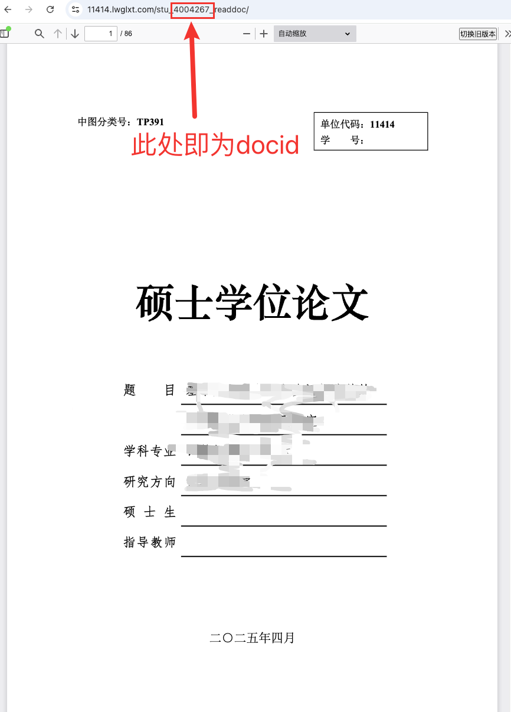

#  CUP AI 凡科平台论文盲审监测脚本

- 本项目是一个自动化论文评审状态监控脚本，支持多账号登录、定时检测、邮件提醒。
- 适用于中国石油大学（北京）人工智能学院 [凡科评审系统](https://11414.lwglxt.com/) 自动追踪专家评审进度。

## 🧩 功能特点

- 支持多个账号并行监控
- 自动登录获取 `PHPSESSID`（无需手动维护 Cookie）
- 识别每位专家的评阅状态、评分、答辩意见
- 评阅完成或新增专家自动邮件提醒对应用户，并抄送指定用户
- 每 30 分钟定时轮询，24 小时自动更新会话 Cookie（该频次可以自定义）
- 日志记录详细状态变化

## 📦 项目结构

```bash
.
├── review_checker.py     # 主程序入口
├── accounts.json         # 账号配置文件（需要手动填写）
├── review_check.log      # 日志文件（自动生成）
├── README.md             # 本说明文件
```

## 📋 依赖环境

- Python 3.7+
- 依赖库：
  ```bash
  pip install requests beautifulsoup4
  ```

## ⚙️ 使用说明

### 1. 填写账号配置

在项目根目录创建或编辑 `accounts.json`，格式如下：

```json
[
  {
    "url": "https://11414.lwglxt.com/student/viewdoc_right?docid=此处为你文章的id&rate=YES",
    "username": "your_username",
    "password": "your_password",
    "receiver": "your_email@example.com",
    "comment": "张三",
    "type": 1  
  }
]
```

- `url`：对应学生的评审详情链接
- `username` / `password`：用于登录的评审系统账号密码
- `receiver`：接收提醒的邮箱
- `comment`：用于标记的备注信息
- `type`：学生类型，1 表示学硕，2 表示专硕，3 表示国家专项计划专硕（如中海油、利雅得专项）
- 关于docid的获取，访问进入凡科平台后，进入论文的盲审页面，上方连接中的数字部分即为docid
<p align="center">
  
</p>


### 2. 启动脚本

```bash
nohup python review_checker.py &
```

程序将自动开启多线程为每个账号监控，日志将写入 `review_check.log`。

## 📧 邮件设置

默认使用 163 邮箱发送提醒邮件，请在代码中修改以下变量以使用你自己的邮箱：

```python
EMAIL_SENDER = "你的发件邮箱"
EMAIL_PASSWORD = "你的邮箱授权码"
SMTP_SERVER = "smtp.163.com"
SMTP_PORT = 465
EMAIL_COPY_RECEIVER = "抄送邮箱"
```

> **注意**：你需要在邮箱设置中开启“SMTP服务”，并使用授权码而非邮箱密码。


## 📝 日志样例

```log
2025-04-30 22:15:03 [INFO] [张三的硕士论文] 状态 - 专家1：已评阅，专家2：未评阅
2025-04-30 23:45:05 [INFO] 张三的硕士论文 - 邮件发送成功: [张三的硕士论文] 专家2 已完成评审 -> your_email@example.com
```

## 🧪 示例效果

当检测到专家完成评阅或新增专家时，你将收到如下邮件：

```
主题：[张三] 专家2 已完成评审

正文：
专家1：已评阅 | 分数：85 | 答辩意见：建议通过
专家2：已评阅 | 分数：90 | 答辩意见：可以参加答辩
```

## 🏁 程序终止条件

- 所有专家完成评阅（学硕和专硕需≥2 位，国家专项计划专硕需≥3 位）
- 程序将发送一封终止通知邮件，并自动结束监控线程

---
